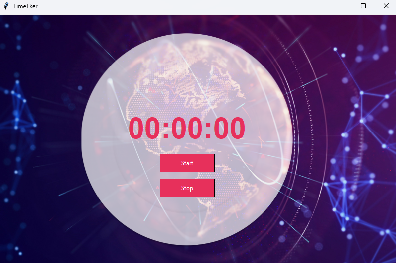

# TimeTker

A simple timer application built using Python and Tkinter.



## Table of Contents

- [Description](#description)
- [Features](#features)
- [Usage](#usage)
- [Installation](#installation)
- [Contributing](#contributing)
- [License](#license)

## Description

This timer application allows users to start and stop a timer, displaying the elapsed time in hours, minutes, and seconds. It utilizes the Tkinter library for the graphical user interface and provides options to start, pause, and reset the timer.

## Features

- Start/Pause: Begin or pause the timer.
- Stop: Stop the timer and record the elapsed time.
- Elapsed Time Display: Shows the elapsed time in hours, minutes, and seconds.
- Data Storage: Stores the recorded timer values with dates in a JSON file.
- User-Friendly Interface: Simple and intuitive design.

## Usage

1. Run the application using Python:
   ```sh
   python timer_app.py

1. Click the "Start" button to start the timer. The timer will begin counting up.
2. Click the "Pause" button to pause the timer. You can then click "Resume" to continue.
3. Click the "Stop" button to stop the timer and store the elapsed time.
4. The timer value will be stored in the timer_data.json file with the corresponding date.

## Installation
1. Clone the repository:
   `git clone https://github.com/Alisadaintanvir/TimeTker.git
    cd TimeTker`
   
2. Install the required dependencies:
  `pip install -r requirements.txt`

3. Run the application:
  `python main.py`

## Contributing
#### Contributions are welcome! If you'd like to contribute to the project, please follow these steps:

- Fork the repository.
- Create a new branch for your feature/bugfix.
- Make your changes and write clear commit messages.
- Push your branch to your forked repository.
- Open a pull request with a detailed description of your changes.

## License
This project is licensed under the MIT License. See the LICENSE file for more information.

